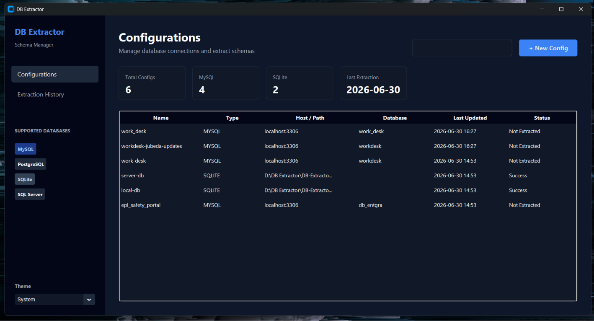
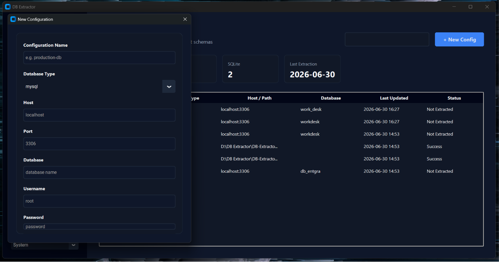
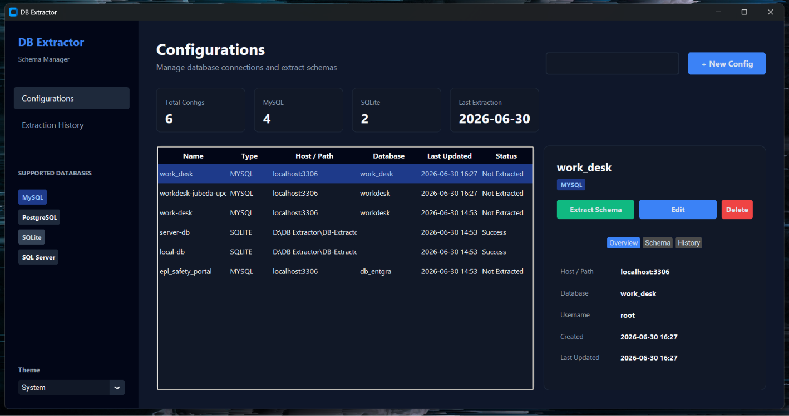
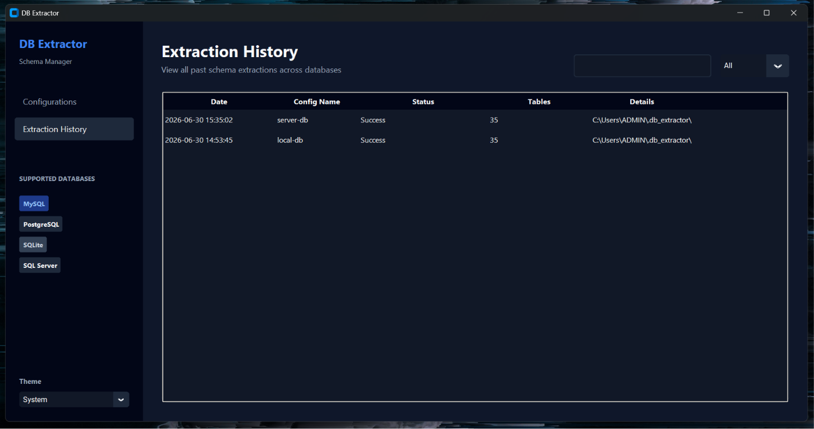
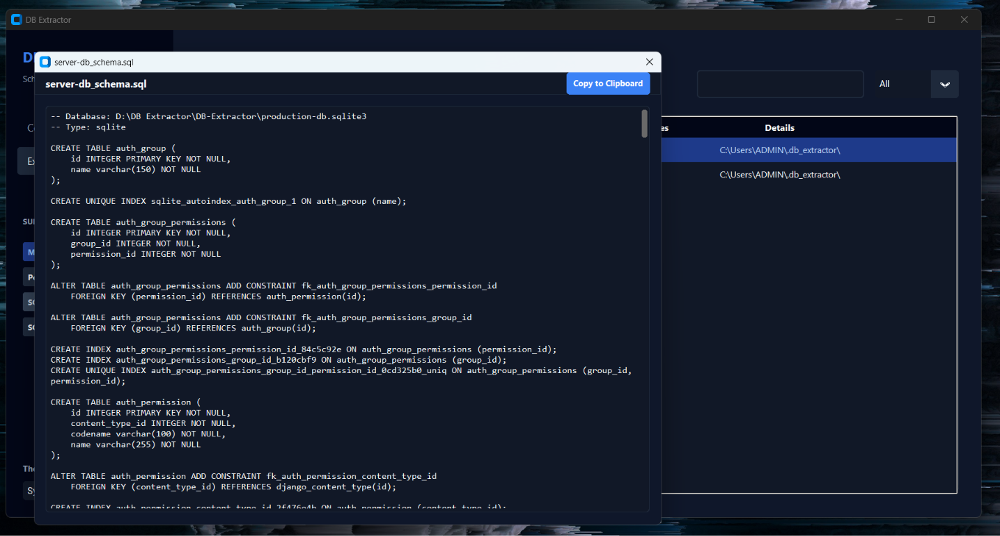
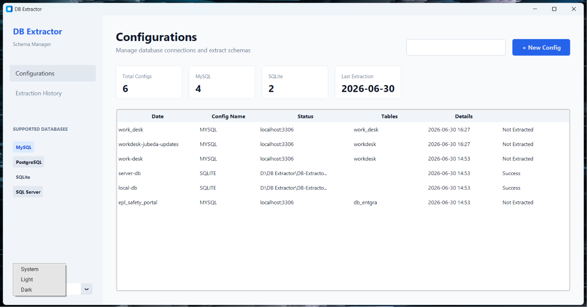

# DB Extractor

A modern, professional desktop application for extracting, viewing, and exporting database schemas. DB Extractor features a gorgeous, responsive graphical user interface with full light/dark mode support.

## 🚀 Features

- **Multi-Database Support**: Extract schemas from MySQL, PostgreSQL, SQLite, and SQL Server.
- **Beautiful Modern UI**: A clean, spacious, and responsive interface inspired by modern SaaS and developer tools.
- **Light & Dark Themes**: Native light and dark mode toggles with hand-crafted, high-contrast color palettes.
- **Extraction History**: Automatically logs every extraction attempt. View past results, error logs, and schema exports instantly with a built-in search filter.
- **Schema Explorer**: Double-click any table in your schema to view its columns, data types, primary keys, and foreign key relationships.
- **Code Viewer**: Built-in raw code viewer with one-click clipboard copying for JSON schemas and SQL DDL.
- **Secure Configuration Management**: Safely store and manage your connection strings in a local SQLite database.

## 📸 Screenshots













## 🛠️ Installation

### Prerequisites
- Python 3.7 or higher
- pip package manager

### Setup

1. Clone the repository:
```bash
git clone https://github.com/AniruddhaManmode/DB-Extractor.git
cd DB-Extractor
```

2. (Optional but recommended) Create a virtual environment:
```bash
python -m venv venv
# On Windows
venv\Scripts\activate
# On macOS/Linux
source venv/bin/activate
```

3. Install the required dependencies:
```bash
pip install -r requirements.txt
```
*Note: The database drivers (`pymysql`, `psycopg2-binary`, `pyodbc`) are optional. You only need to install the drivers for the databases you actually plan to connect to.*

## 💻 Usage

Run the application using Python:
```bash
python gui_app.py
```

1. Click **+ New Config** to add a database connection.
2. Select your config from the list and click **Extract Schema** to generate the JSON and SQL DDL.
3. Use the right-side details panel to view the schema table by table.
4. Export or copy the generated SQL/JSON using the **View JSON** and **View SQL DDL** buttons.

## 🗃️ Export Formats
When a schema is extracted, it is automatically saved to the `~/.db_extractor/schemas/` directory in two formats:
- **JSON Format**: A comprehensive JSON representation of all tables, columns, indexes, and relationships.
- **SQL DDL**: Ready-to-execute `CREATE TABLE` SQL statements generated from your schema structure.
